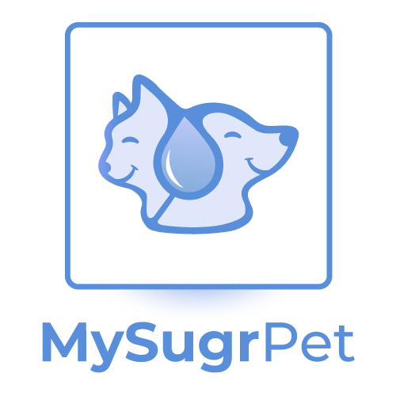

<div id="top"></div>
<!--
*** Thanks for checking out the Best-README-Template. If you have a suggestion
*** that would make this better, please fork the repo and create a pull request
*** or simply open an issue with the tag "enhancement".
*** Don't forget to give the project a star!
*** Thanks again! Now go create something AMAZING! :D
-->

<!-- PROJECT SHIELDS -->
<!--
*** I'm using markdown "reference style" links for readability.
*** Reference links are enclosed in brackets [ ] instead of parentheses ( ).
*** See the bottom of this document for the declaration of the reference variables
*** for contributors-url, forks-url, etc. This is an optional, concise syntax you may use.
*** https://www.markdownguide.org/basic-syntax/#reference-style-links
-->

[![Contributors][contributors-shield]][contributors-url]
[![Forks][forks-shield]][forks-url]
[![Stargazers][stars-shield]][stars-url]
[![Issues][issues-shield]][issues-url]
[![MIT License][license-shield]][license-url]
[![LinkedIn][linkedin-shield]][linkedin-url]

<!-- PROJECT LOGO -->
<br />
<div align="center">
  <a href="https://github.com/dlongodev/my-sugr-pet">
    
  </a>

  <p align="center">
    MySugrPet is an insulin tracking application for pets with diabetes. 
    <br />
    <a href="https://github.com/dlongodev/my-sugr-pet"><strong>Explore the docs »</strong></a>
    <br />
    <br />
    <a href="https://mysugrpet.onrender.com/">View Demo</a>
    ·
    <a href="https://github.com/dlongodev/my-sugr-pet/issues">Report Bug</a>
    ·
    <a href="https://github.com/dlongodev/my-sugr-pet/issues">Request Feature</a>
  </p>
</div>

<!-- TABLE OF CONTENTS -->
<details>
  <summary>Table of Contents</summary>
  <ol>
    <li>
      <a href="#about-the-project">About The Project</a>
      <ul>
        <li><a href="#built-with">Built With</a></li>
      </ul>
    </li>
    <li>
      <a href="#getting-started">Getting Started</a>
      <ul>
        <li><a href="#prerequisites">Prerequisites</a></li>
        <li><a href="#installation">Installation</a></li>
      </ul>
    </li>
    <li><a href="#roadmap">Roadmap</a></li>
    <li><a href="#contributing">Contributing</a></li>
    <li><a href="#contributing">Changelog</a></li>
    <li><a href="#license">License</a></li>
    <li><a href="#contact">Contact</a></li>
    <li><a href="#acknowledgments">Acknowledgments</a></li>
  </ol>
</details>

<!-- ABOUT THE PROJECT -->

## About The Project

If you have a diabetic pet, you know keeping track of the date, time, dosage and injection location is not an easy task. This tracker is simple but extremely helpful to make sure you are doing the right thing for your pet to stay healthy. This web application comes with an easy to use UI with visuals to make sure you're making the right choice everyday for insulin injection location, personalized with your pet's photo, and useful for when you need to reference your records when visiting your vet.

### Screenshots

[![Product Name Screen Shot][product-screenshot]](https://mysugrpet.onrender.com/)

### Original Wireframes

[![Product Name Screen Shot][product-wireframe]](https://mysugrpet.onrender.com/)

<p align="right">(<a href="#top">back to top</a>)</p>

### Built With

- [Node.js](https://nodejs.org/)
- [Express.js](https://expressjs.org/)
- [MongoDB](https://www.mongodb.com/atlas/database)
- [MongooseJS](https://mongoosejs.com/)
- [<%= EJS %>](https://ejs.co/)
- [Javascript](https://developer.mozilla.org/en-US/docs/Web/JavaScript)
- [HTML5](https://svelte.dev/)
- [SCSS](https://sass-lang.com/)
- [Passport.js](https://www.passportjs.org/)
- [Bootstrap](https://getbootstrap.com)
- [Multer](https://github.com/expressjs/multer)
- [Cloudinary](https://cloudinary.com/)

<p align="right">(<a href="#top">back to top</a>)</p>

<!-- GETTING STARTED -->

## Getting Started

To get a local copy up and running follow these simple example steps.

### Installation

1. Clone the repo
   ```sh
   git clone https://github.com/dlongodev/my-sugr-pet.git
   ```
2. Install NPM packages
   ```sh
   npm install
   ```
3. Create `.env` file
   ```js
   PORT='3300'
   MONGODB_URI='mongodb://localhost:27017/mysugrpet'
   DB_URL="MongoDB-Database-Link"
   SECRET='thisisasecretthatwillchangelater"
   CLOUDINARY_CLOUD_NAME=put-your-cloudinary-name
   CLOUDINARY_KEY=put-your-cloudinary-key
   CLOUDINARY_SECRET=put-your-cloudinary-secret
   ```
4. Run local environment
   ```js
   npm run dev
   ```

<p align="right">(<a href="#top">back to top</a>)</p>

<!-- ROADMAP -->

## Roadmap

### MVP / User Stories

- [x] As a user, I can register my information so I can log in when I want to use the tracker
- [x] As a user, I can create a profile for my pet so I can have his information saved for when I need it
- [x] As a user, I can choose my pet to be a dog or cat and the interface will show icons that present my pet
- [x] As a user, I can easily see the buttons I need to press so I can begin tracking my pet insulin injections
- [x] As a user, when I need to choose the injection location, I can easily see the last 4 injections so I can make the right location decision
- [x] As a user, I want to be able to fix the data if I make a mistake
- [x] As a user, I want to be able to delete an entry if I make a mistake
- [x] As a user, I want to be able to make changes to my pet profile

### Stretch Goals

- [ ] As a user, I want to export the data so I can show it to my vet
- [x] As a user, I want to add my pet photo to his profile
- [ ] As a user, I want to keep a record of my pet medical history on its profile, from glucose levels to observational behaviors
- [ ] As a user, I want to have a record of vet visits and expenses
- [ ] As a user, I want to create reminders for daily insulin shots, food, water, and exercise

See the [open issues](https://github.com/dlongodev/my-sugr-pet/issues) for a full list of proposed features (and known issues).

<p align="right">(<a href="#top">back to top</a>)</p>

<!-- CONTRIBUTING -->

## Contributing

Contributions are what make the open source community such an amazing place to learn, inspire, and create. Any contributions you make are **greatly appreciated**.

If you have a suggestion that would make this better, please fork the repo and create a pull request. You can also simply open an issue with the tag "enhancement".
Don't forget to give the project a star! Thanks again!

1. Fork the Project
2. Create your Feature Branch (`git checkout -b feature/AmazingFeature`)
3. Commit your Changes (`git commit -m 'Add some AmazingFeature'`)
4. Push to the Branch (`git push origin feature/AmazingFeature`)
5. Open a Pull Request

<p align="right">(<a href="#top">back to top</a>)</p>

<!-- CHANGELOG -->

## Changelog

Look at [CHANGELOG.md](/CHANGELOG.md) for this project.

<p align="right">(<a href="#top">back to top</a>)</p>

<!-- LICENSE -->

## License

Distributed under the MIT License. See `LICENSE.txt` for more information.

<p align="right">(<a href="#top">back to top</a>)</p>

<!-- CONTACT -->

## Contact

Daniele Longo - [@dlongodev](https://twitter.com/dlongodev) - dlongodev@gmail.com

Project Link: [https://github.com/dlongodev/my-sugr-pet](https://github.com/dlongodev/my-sugr-pet)

<p align="right">(<a href="#top">back to top</a>)</p>

<!-- ACKNOWLEDGMENTS -->

## Acknowledgments

- [General Assembly 9/28 SEI-Flex](https://generalassemb.ly/)
- Billie Heidelberg - SEI Lead
- Matt Keane - Instructional Associate
- Paresh Sharma - Instructional Associate
- [Colt Steele - YelpCamp Lessons](https://www.udemy.com/course/the-web-developer-bootcamp/)
- [Pet icon by catalyststuff & app design inspiration from pikisuperstar - freepik](https://www.freepik.com/popular-vectors)

<p align="right">(<a href="#top">back to top</a>)</p>

<!-- MARKDOWN LINKS & IMAGES -->
<!-- https://www.markdownguide.org/basic-syntax/#reference-style-links -->

[contributors-shield]: https://img.shields.io/github/contributors/dlongodev/my-sugr-pet.svg?style=for-the-badge
[contributors-url]: https://github.com/dlongodev/my-sugr-pet/graphs/contributors
[forks-shield]: https://img.shields.io/github/forks/dlongodev/my-sugr-pet.svg?style=for-the-badge
[forks-url]: https://github.com/dlongodev/my-sugr-pet/network/members
[stars-shield]: https://img.shields.io/github/stars/dlongodev/my-sugr-pet.svg?style=for-the-badge
[stars-url]: https://github.com/dlongodev/my-sugr-pet/stargazers
[issues-shield]: https://img.shields.io/github/issues/dlongodev/my-sugr-pet.svg?style=for-the-badge
[issues-url]: https://github.com/dlongodev/my-sugr-pet/issues
[license-shield]: https://img.shields.io/github/license/dlongodev/my-sugr-pet.svg?style=for-the-badge
[license-url]: https://github.com/dlongodev/my-sugr-pet/blob/master/LICENSE.txt
[linkedin-shield]: https://img.shields.io/badge/-LinkedIn-black.svg?style=for-the-badge&logo=linkedin&colorB=555
[linkedin-url]: https://linkedin.com/in/danielealongo
[product-wireframe]: images/mySugrPet_wireframes.jpg
[product-screenshot]: images/mySugrPet_screenshots.jpg
